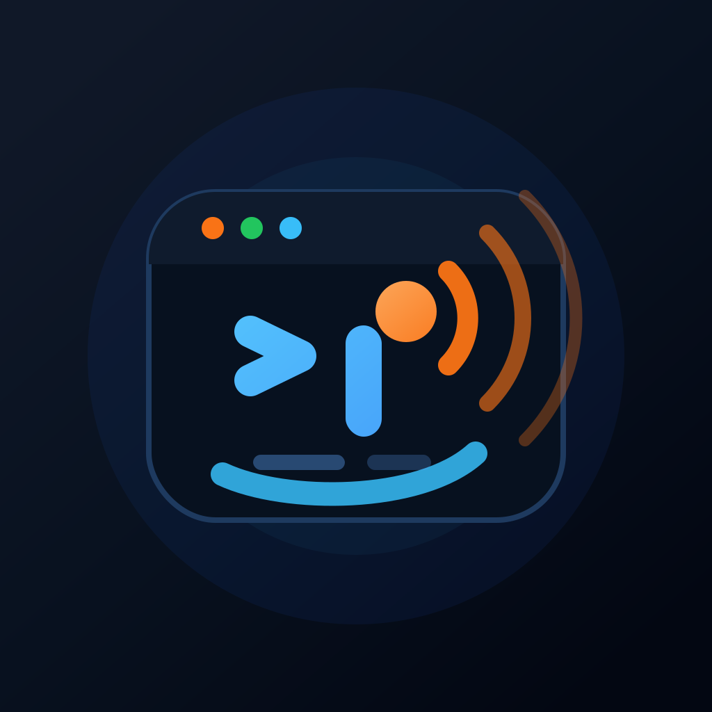
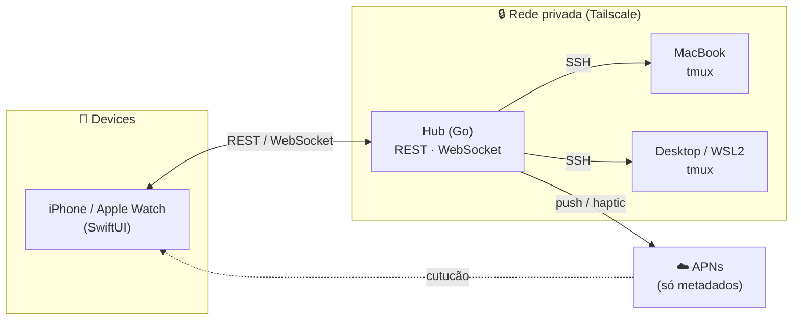

<div align="center">



# Cutuque

**Seus agentes de terminal no bolso — com um cutucão no pulso quando precisam de você.**

Painel de controle remoto, com avisos hápticos, para agentes de terminal
(Claude Code · Codex · OpenCode) rodando nas suas máquinas — operado do iPhone e do Apple Watch,
sobre a sua rede privada, **sem nuvem de terceiros**.

<br/>

[](./LICENSE)


</div>

---

> **Cutuque** vem de _cutucar_. A ideia é essa: você dispara uma tarefa, larga o
> telefone e vive a vida — quando o agente conclui ou trava pedindo permissão,
> ele te **cutuca** com uma vibração no Apple Watch. Você aprova pelo relógio e
> segue em frente. De qualquer lugar.

## ✨ Destaques

- 🖥️ **Multi-agente** — controla Claude Code, Codex e OpenCode; no fallback, qualquer comando de terminal.
- 🔁 **Loop completo** — disparar → acompanhar output ao vivo → aprovar permissão → ser avisado, tudo do celular/Watch.
- ⌚ **Cutucão confiável** — vibração _time-sensitive_ no pulso mesmo com o app fechado (fura Foco/DND quando importa).
- 🏝️ **Live Activity** — sessões rodando aparecem na Dynamic Island e na tela de bloqueio.
- 🔒 **Privado por design** — o código-fonte nunca sai da sua rede (Tailscale); ao APNs vão só metadados (“sessão X concluiu”).
- 🗂️ **Board Kanban** — Command Center web + CLI `cutuque` para acompanhar o que cada agente está fazendo.
- 🎛️ **Deck físico** — plugin para o Ulanzi Stream Deck com atalhos e visão rápida das sessões.

## 🚦 Estados de uma sessão

| | Estado | Significado |
|:---:|---|---|
| 🔵 | `running` (`#2D7FF9`) | Agente trabalhando. |
| 🟠 | `needs_you` (`#F5A623`) | Travou pedindo permissão — **é aqui que rola o cutucão**. |
| 🟢 | `done` (`#3DC46A`) | Concluiu a tarefa. |
| 🔴 | `error` (`#E5484D`) | Falhou. |
| ⚪ | `idle` (`#6B7280`) | Sem atividade. |

## 🏗️ Arquitetura



## 🧩 Componentes

| Pasta | O que é |
|-------|---------|
| **`hub/`** | Servidor Go (binário único): descobre e controla as sessões, expõe REST/WebSocket e envia push via APNs. |
| **`app/`** | App nativo iOS + watchOS (SwiftUI): dispara, acompanha, aprova e recebe os avisos hápticos. |
| **`board/`** | Command Center web + CLI `cutuque` (Kanban dos agentes). |
| **`deck/`** | Plugin para o deck físico Ulanzi (atalhos e visão rápida). |
| **`docs/`** | Visão geral, arquitetura, decisões e planos. |
| **`config/`** | Templates de configuração (`*.example`). |

## 🚀 Começando

### 1. Hub (Go)

```bash
cd hub
go build ./cmd/hub
CUTUQUE_ENV=dev ./hub          # sobe local em 127.0.0.1:8787 para desenvolvimento
```

Em produção, copie o template e preencha os valores reais (nada de segredo é versionado):

```bash
cp config/hub.env.example config/hub.env
# edite host, token e credenciais APNs
```

### 2. App (iOS / watchOS)

```bash
cd app
xcodegen generate             # gera o CutuqueApp.xcodeproj a partir do project.yml
open CutuqueApp.xcodeproj      # build & run pelo Xcode
```

### 3. Board & Deck (Node)

```bash
cd board && npm install && npm start    # Command Center web + CLI
cd deck  && npm install                 # plugin do Ulanzi
```

## ⚙️ Configuração

Tudo vem de variáveis de ambiente (ver [`config/hub.env.example`](./config/hub.env.example)):

| Variável | Descrição |
|----------|-----------|
| `CUTUQUE_HUB` | Endereço do hub usado pela CLI/deck (`host:porta`). |
| `CUTUQUE_BIND` | Interface em que o hub escuta em produção. |
| `CUTUQUE_TOKEN` | Bearer token dos devices e das chamadas de comando. |
| `CUTUQUE_APNS_*` | Credenciais APNs (opcionais; sem elas, o hub sobe sem push). |
| `CUTUQUE_SSH_TARGETS` | Máquinas-alvo no formato `nome=user@host,...`. |
| `CUTUQUE_MAX_SESSIONS` | Teto de sessões concorrentes vivas. |

> 💡 Os IPs e hosts nos exemplos e testes usam a faixa de documentação
> `192.0.2.0/24` (RFC 5737) — troque pelos seus.

## 🧪 Testes

```bash
cd hub   && go test ./...              # suíte Go do hub
cd deck  && npm install && npm test    # deck
cd board && npm install && npm test    # board / CLI
```

## 📂 Estrutura

```
cutuque/
├── app/        # iOS + watchOS (SwiftUI)
├── hub/        # servidor Go
├── board/      # Command Center web + CLI
├── deck/       # plugin Ulanzi Stream Deck
├── config/     # templates de configuração
├── docs/       # documentação e planos
└── assets/     # ícones e arte
```

## 📄 Licença

Copyright © 2026 **vxfontes**.

Distribuído sob a **GNU Affero General Public License v3.0** — veja [`LICENSE`](./LICENSE).
Em resumo: você pode usar, estudar e modificar o código, mas qualquer versão
distribuída ou oferecida como serviço em rede precisa disponibilizar o
código-fonte correspondente sob a mesma licença.

<div align="center">
<br/>
<sub>Feito para caber no seu fluxo — e te cutucar só quando precisa. 🧡</sub>
</div>
