<div align="center">

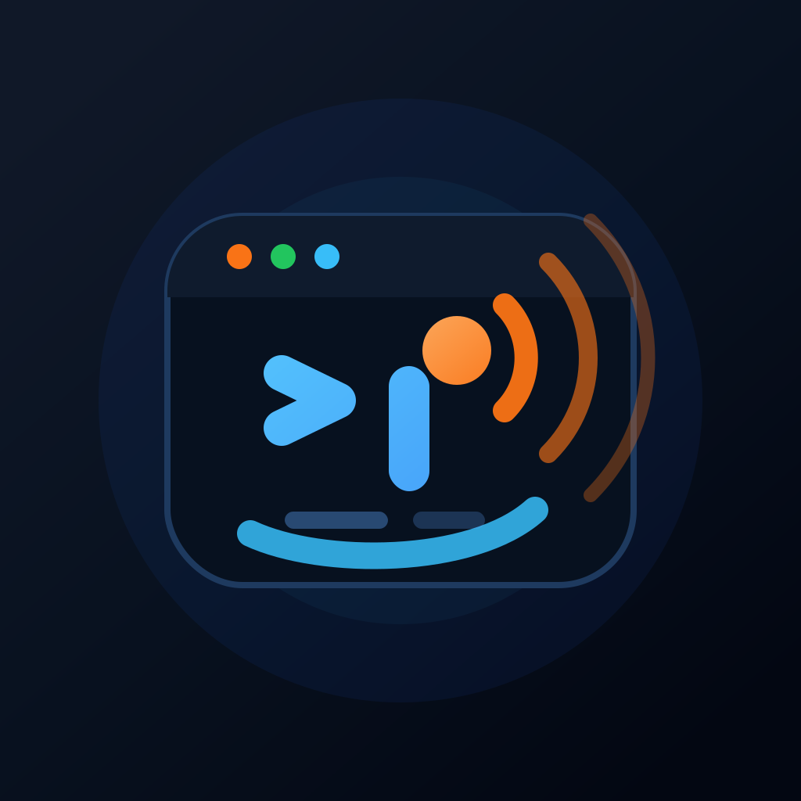

# Cutuque

**Seus agentes de terminal no bolso — com um cutucão no pulso quando precisam de você.**

Painel de controle remoto, com avisos hápticos, para agentes de terminal
(Claude Code · Codex · OpenCode) rodando nas suas máquinas — operado do iPhone e do Apple Watch,
sobre a sua rede privada, **sem nuvem de terceiros**.

<br/>

[](./LICENSE)


</div>

---

> **Cutuque** vem de _cutucar_. A ideia é essa: você dispara uma tarefa, larga o
> telefone e vive a vida — quando o agente conclui ou trava pedindo permissão,
> ele te **cutuca** com uma vibração no Apple Watch. Você aprova pelo relógio e
> segue em frente. De qualquer lugar.

## 📸 Como é na prática

**Apple Watch** — o cutucão chega aqui. Lista do que travou, aprovar/negar sem tirar o telefone do bolso.

<div align="center">
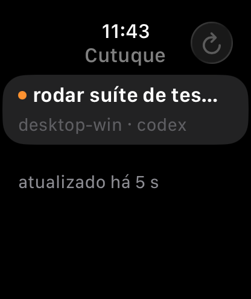
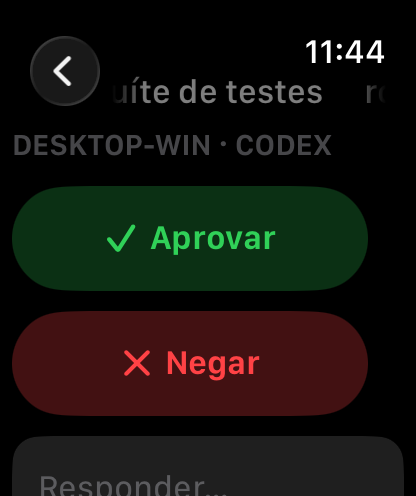
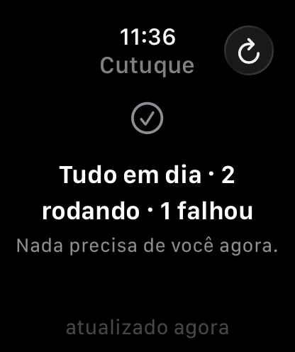
</div>

<sub>A tela vazia diz o que os outros agentes estão fazendo (“Tudo em dia · 2 rodando · 1 falhou”) e o rodapé conta a idade do dado — “tudo em dia” nunca é chute.</sub>

**iPhone** — sessões, terminal tmux ao vivo, board e o guia embutido.

| Sessões | Terminal | Board | Como funciona |
|:---:|:---:|:---:|:---:|
| 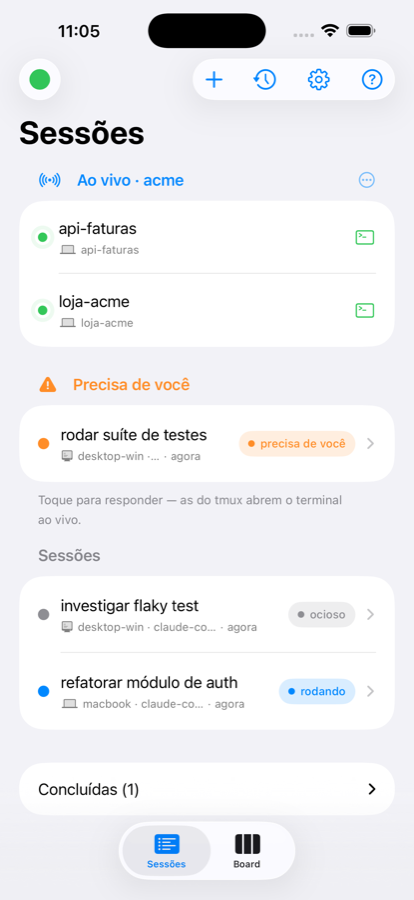 | 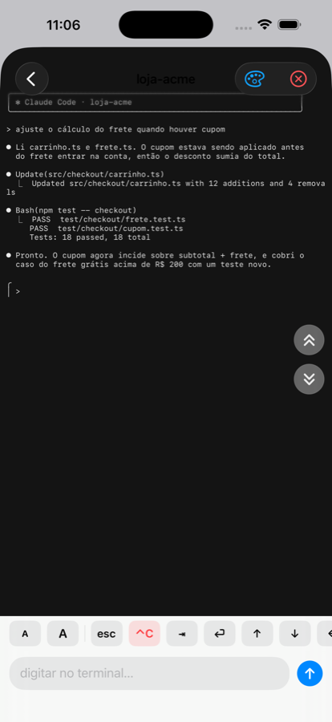 | 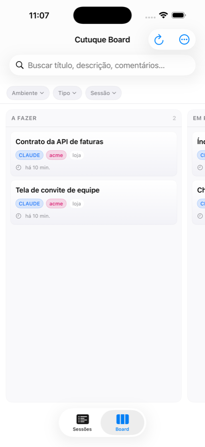 | 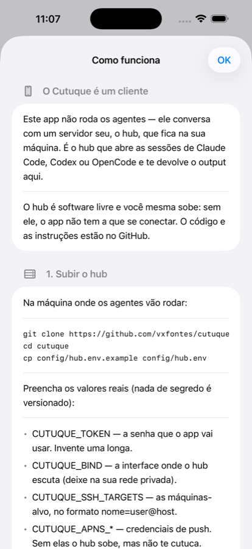 |

**iPad** — as mesmas telas em split view, com a barra lateral sempre à mão.

| Sessões | Terminal | Board | Como funciona |
|:---:|:---:|:---:|:---:|
| 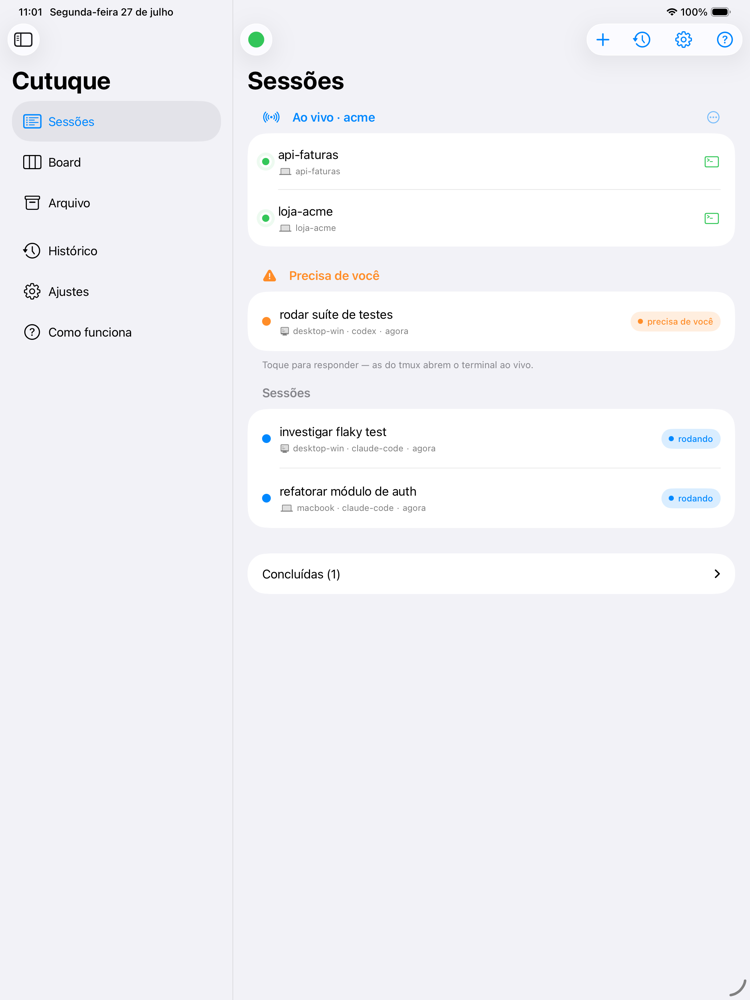 | 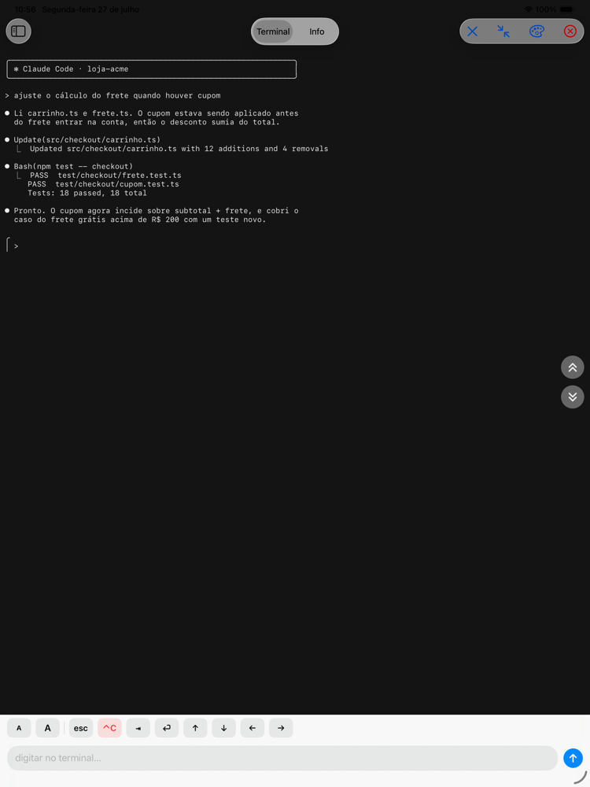 | 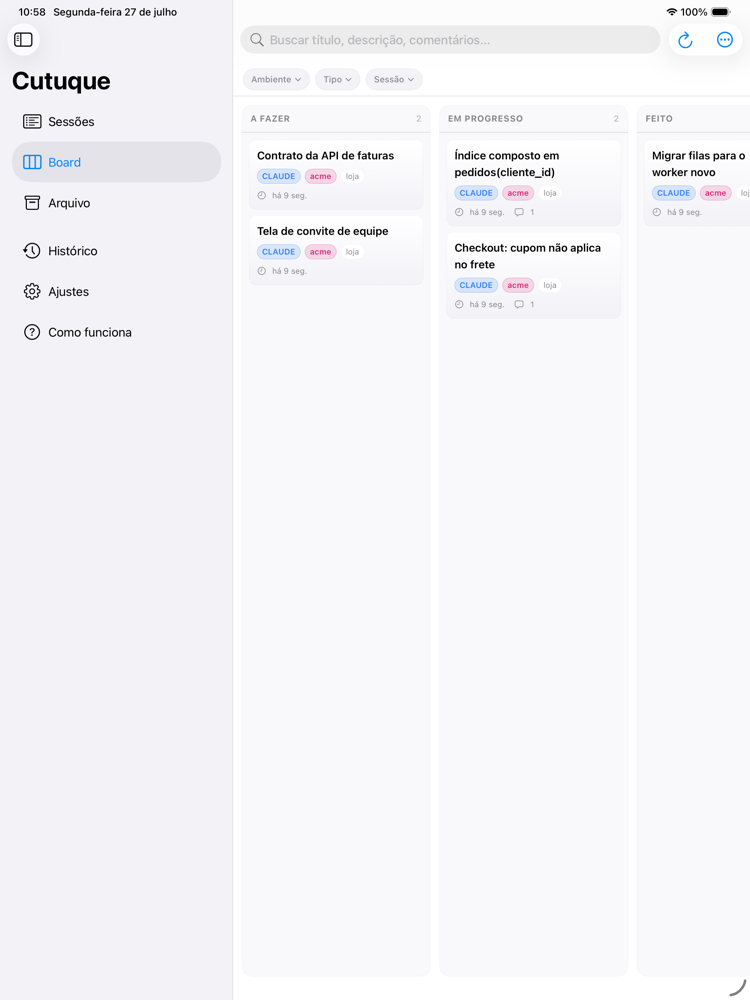 | 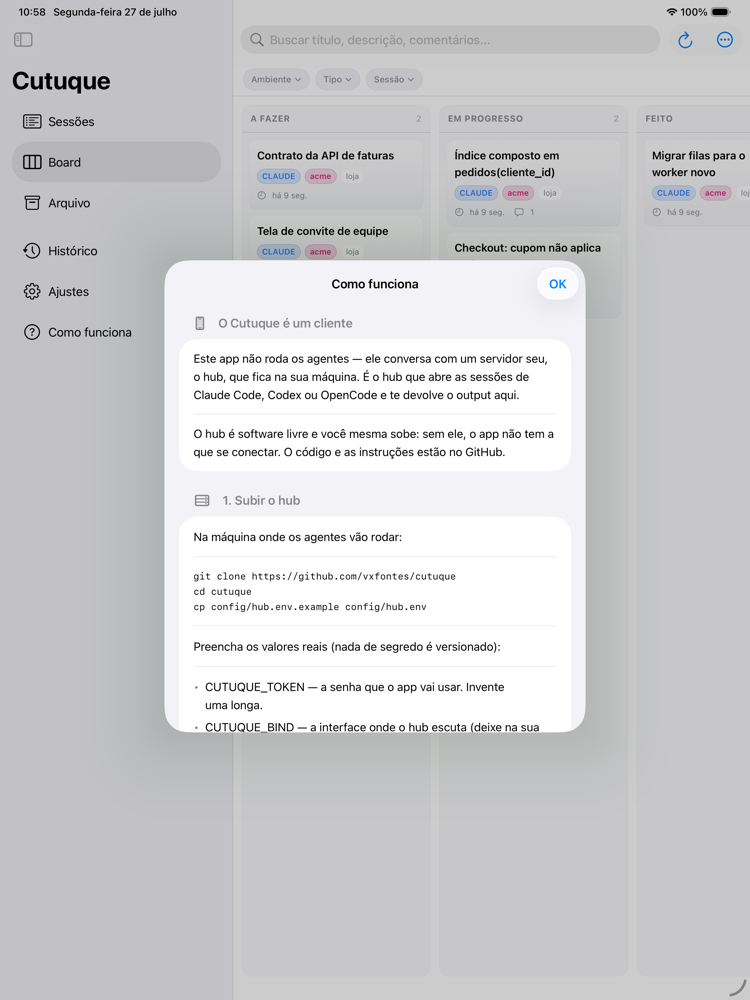 |

<sub>Capturas do simulador contra um hub de demonstração com dados fictícios.</sub>

## ✨ Destaques

- 🖥️ **Multi-agente** — controla Claude Code, Codex e OpenCode; no fallback, qualquer comando de terminal.
- 🔁 **Loop completo** — disparar → acompanhar output ao vivo → aprovar permissão → ser avisado, tudo do celular/Watch.
- ⌚ **Cutucão confiável** — vibração _time-sensitive_ no pulso mesmo com o app fechado (fura Foco/DND quando importa).
- 🏝️ **Live Activity** — sessões rodando aparecem na Dynamic Island e na tela de bloqueio.
- 🪟 **iPad em split view** — barra lateral fixa e detalhe lado a lado, com o terminal ao vivo.
- 🔒 **Privado por design** — o código-fonte nunca sai da sua rede (Tailscale); ao APNs vão só metadados (“sessão X concluiu”).
- 🗂️ **Board Kanban** — Command Center web + CLI `cutuque` para acompanhar o que cada agente está fazendo.
- 🎛️ **Deck físico** — plugin para o Ulanzi Stream Deck com atalhos e visão rápida das sessões.

## 🚦 Estados de uma sessão

| | Estado | Significado |
|:---:|---|---|
| 🔵 | `running` (`#2D7FF9`) | Agente trabalhando. |
| 🟠 | `needs_you` (`#F5A623`) | Travou pedindo permissão — **é aqui que rola o cutucão**. |
| 🟢 | `done` (`#3DC46A`) | Concluiu a tarefa. |
| 🔴 | `error` (`#E5484D`) | Falhou. |
| ⚪ | `idle` (`#6B7280`) | Sem atividade. |

## 🏗️ Arquitetura

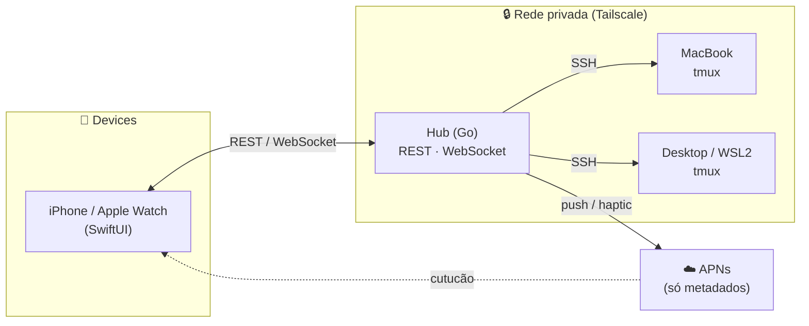
```mermaid
flowchart LR
    subgraph devices["📱 Devices"]
        iPhone["iPhone / Apple Watch<br/>(SwiftUI)"]
    end
    subgraph net["🔒 Rede privada (Tailscale)"]
        Hub["Hub (Go)<br/>REST · WebSocket"]
        M1["MacBook<br/>tmux"]
        M2["Desktop / WSL2<br/>tmux"]
    end
    Apple["☁️ APNs<br/>(só metadados)"]

    iPhone <-->|"REST / WebSocket"| Hub
    Hub -->|"SSH"| M1
    Hub -->|"SSH"| M2
    Hub -->|"push / haptic"| Apple
    Apple -.->|"cutucão"| iPhone
```

## 🧩 Componentes

| Pasta | O que é |
|-------|---------|
| **`hub/`** | Servidor Go (binário único): descobre e controla as sessões, expõe REST/WebSocket e envia push via APNs. |
| **`app/`** | App nativo iOS + watchOS (SwiftUI): dispara, acompanha, aprova e recebe os avisos hápticos. |
| **`board/`** | Command Center web + CLI `cutuque` (Kanban dos agentes). |
| **`deck/`** | Plugin para o deck físico Ulanzi (atalhos e visão rápida). |
| **`docs/`** | Visão geral, arquitetura, decisões e planos. |
| **`config/`** | Templates de configuração (`*.example`). |
| **`scripts/`** | Atalhos de terminal — `tmx.sh` sobe agentes em sessões tmux que o app enxerga. |

## 🚀 Começando

### 1. Hub (Go)

```bash
cd hub
go build ./cmd/hub
CUTUQUE_ENV=dev ./hub          # sobe local em 127.0.0.1:8787 para desenvolvimento
```

Em produção, copie o template e preencha os valores reais (nada de segredo é
versionado). O `config/` fica na **raiz** do repositório, não em `hub/`:

```bash
cd ..                          # volta para a raiz do repo
cp config/hub.env.example config/hub.env
# edite host, token e credenciais APNs
```

### 2. App (iOS / watchOS)

```bash
cd app
xcodegen generate             # gera o CutuqueApp.xcodeproj a partir do project.yml
open CutuqueApp.xcodeproj      # build & run pelo Xcode
```

### 3. Board & Deck (Node)

```bash
cd board && npm install && npm start    # Command Center web + CLI
cd deck  && npm install                 # plugin do Ulanzi
```

O **Command Center** (kanban dos agentes) é servido pelo próprio hub em
`http://<seu-hub>:8787/dashboard`. A CLI `cutuque` se instala a partir dele:

```bash
curl -fsSL http://<seu-hub>:8787/install | sh
```

### 4. tmux (opcional, mas é o jeito mais rápido)

[`scripts/tmx.sh`](./scripts/tmx.sh) são atalhos de tmux que sobem um agente
já dentro de uma sessão nomeada — e é isso que faz ela aparecer no app em
**"Continuar sessão do Mac"**:

```bash
ln -s "$PWD/scripts/tmx.sh" /usr/local/bin/tmx

cd ~/meu-projeto
tmx cc          # Claude Code na pasta atual (sessão = nome da pasta)
tmx cx          # Codex
tmx oc          # OpenCode
tmx ls          # lista as sessões do grupo atual
```

Dá pra separar contextos em "grupos" (servidores tmux distintos), via
`TMX_SRV=trabalho tmx cc` ou como 3º argumento: `tmx cc api trabalho`.

## ⚙️ Configuração

Tudo vem de variáveis de ambiente (ver [`config/hub.env.example`](./config/hub.env.example)):

| Variável | Descrição |
|----------|-----------|
| `CUTUQUE_HUB` | Endereço do hub usado pela CLI/deck (`host:porta`). |
| `CUTUQUE_BIND` | Interface em que o hub escuta em produção. |
| `CUTUQUE_TOKEN` | Bearer token dos devices e das chamadas de comando. |
| `CUTUQUE_APNS_*` | Credenciais APNs (opcionais; sem elas, o hub sobe sem push). |
| `CUTUQUE_SSH_TARGETS` | Máquinas-alvo no formato `nome=user@host,...`. |
| `CUTUQUE_MAX_SESSIONS` | Teto de sessões concorrentes vivas. |
| `CUTUQUE_LOCAL_SHELL` | Abre o terminal **dentro do container do hub**, quando não há máquina remota. Só para o hub de demonstração. |
| `CUTUQUE_PUBLIC` | Declara que o hub está na **internet aberta**: tira do ar o `/dashboard` (que serve o token dentro do HTML) e a escrita do `/board` (que não pede token). |
| `CUTUQUE_ACCESS_LOG` | Imprime **uma linha por request** e registra o `GET /dev/usage` (com token) com o resumo de quem bateu na caixa. Liga sozinha junto com `CUTUQUE_PUBLIC`; desligue com `=0`. |

> ⚠️ `CUTUQUE_LOCAL_SHELL` e `CUTUQUE_PUBLIC` são **desligadas por omissão e por
> qualquer valor que não seja um "sim" explícito** (`1`, `true`, `yes`, `on`,
> `sim`). Elas existem por causa da caixa pública de demonstração do review da
> App Store — num hub de casa, atrás do Tailscale, nenhuma das duas deve estar
> ligada.

> 📋 `CUTUQUE_ACCESS_LOG` é a exceção: ela acompanha o modo público **por
> implicação**, porque caixa exposta sem log é caixa cega (o Render no plano
> Hobby não oferece HTTP request logs — é recurso de Pro pra cima) e sem ela não
> há como saber se o revisor chegou a conectar ou se errou o token. Para calar o
> log num hub público, escreva o "não" explícito `CUTUQUE_ACCESS_LOG=0` — ele
> ganha da implicação. O log **nunca** escreve a query string (o token do
> WebSocket viaja nela) nem conteúdo de sessão.

> 💡 Os IPs e hosts nos exemplos e testes usam a faixa de documentação
> `192.0.2.0/24` (RFC 5737) — troque pelos seus.

## 🧪 Testes

```bash
cd hub   && go test ./...              # suíte Go do hub
cd deck  && npm install && npm test    # deck
cd board && npm install && npm test    # board / CLI
```

## 📂 Estrutura

```
cutuque/
├── app/        # iOS + watchOS (SwiftUI)
├── hub/        # servidor Go
├── board/      # Command Center web + CLI
├── deck/       # plugin Ulanzi Stream Deck
├── config/     # templates de configuração
├── docs/       # documentação e planos
├── scripts/    # atalhos de terminal (tmx.sh)
└── assets/     # ícones e arte
```

## 📄 Licença

Copyright © 2026 **vxfontes**.

Distribuído sob a **GNU Affero General Public License v3.0** — veja [`LICENSE`](./LICENSE).
Em resumo: você pode usar, estudar e modificar o código, mas qualquer versão
distribuída ou oferecida como serviço em rede precisa disponibilizar o
código-fonte correspondente sob a mesma licença.

<div align="center">
<br/>
<sub>Feito para caber no seu fluxo — e te cutucar só quando precisa. 🧡</sub>
</div>
